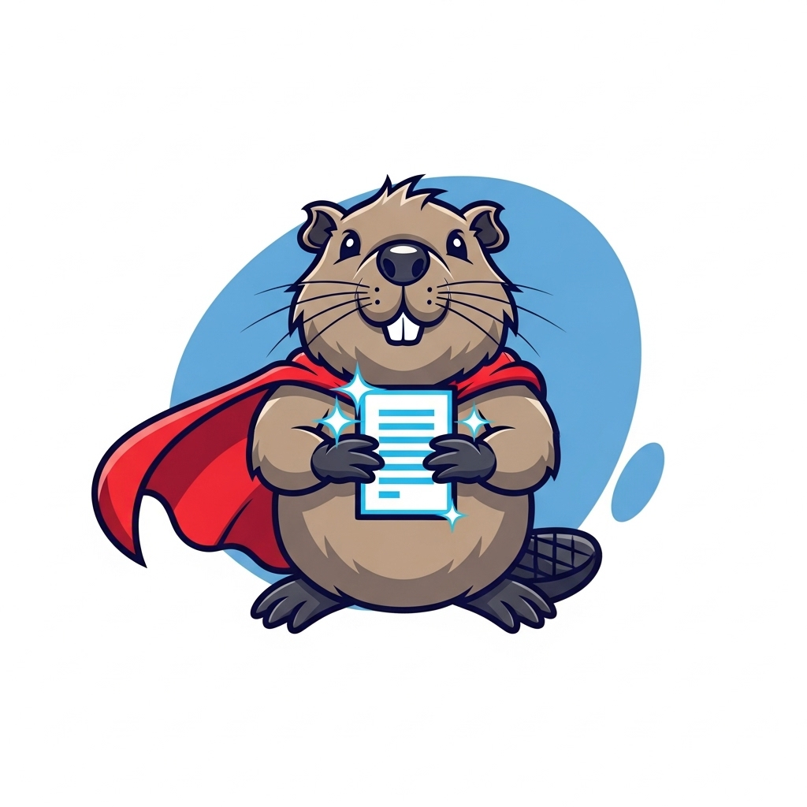

# Super Ragondin



This repository is a place where I can put ideas and experiments on a new
desktop client for Cozy Cloud.

## Usage

### Prerequisites

- Rust (edition 2024)
- A [Cozy Cloud](https://cozy.io) instance

### Build

```bash
cargo build --release
```

The binary will be available at `target/release/super-ragondin`.

### Getting started

1. **Initialize** the configuration by providing your Cozy instance URL and the
   local directory to sync:

   ```bash
   super-ragondin init https://yourname.mycozy.cloud ~/Cozy
   ```

   This creates the config file (`~/.config/super-ragondin/config.json`), the
   sync directory, and the data directory (`~/.local/share/super-ragondin/`).

2. **Authenticate** with your Cozy:

   ```bash
   super-ragondin auth
   ```

   This registers an OAuth client, then prints an authorization URL to open in
   your browser. After authorizing, paste the code back into the terminal.

3. **Sync** your files:

   ```bash
   super-ragondin sync    # Run a single sync cycle
   super-ragondin watch   # Watch for changes and sync continuously (Ctrl+C to stop)
   ```

4. **Check status** at any time:

   ```bash
   super-ragondin status
   ```

   Shows the instance URL, sync directory, authentication state, tree sizes,
   and pending operations.

### Logging

Logging is controlled via the `RUST_LOG` environment variable (using
[`tracing-subscriber`](https://docs.rs/tracing-subscriber)):

```bash
RUST_LOG=info super-ragondin watch
RUST_LOG=debug super-ragondin sync
```

## What would be needed for a full client

There are a lot of things that are out of the scope for this proof of concept.
This work would be needed if we want to release a new desktop client for Cozy
users:

- Support of Windows and macOS
- GUI
- packagingn auto-update, and auto-start
- logs, sentry, and a way to contact the support team
- documentation
- use the trash of the local computer
- managing errors like cozy blocked or moved to a new address
- quota on the Cozy, and no more space on the local disk
- opening cozy-notes
- shared drives
- etc.

## Development

### Commands

```bash
cargo build                   # Build the project
cargo fmt --all               # Format the code
cargo test -q                 # Run tests
cargo clippy --all-features   # Run linter (pedantic + nursery enabled)
```

To run 100 simulation tests:

```bash
PROPTEST_CASES=100 cargo test -q prop_
```

## License

The code is licensed as GNU AGPLv3. See the LICENSE file for the full license.

♡2026 by Bruno Michel. Copying is an act of love. Please copy and share.
